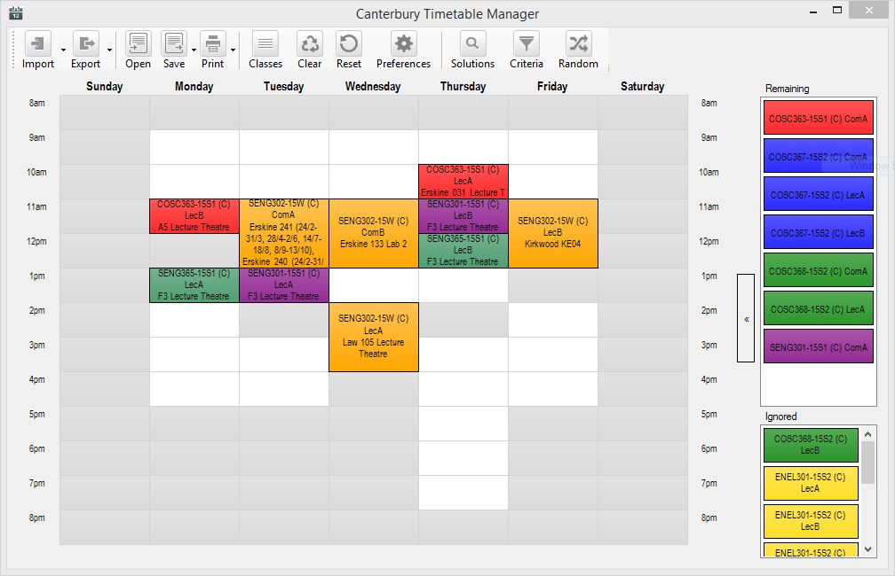

Canterbury Timetable Manager
==========================

Designed for University of Canterbury students to select the best possible timetable for your course based on a set of selectable criteria. Updated to add automatic downloading of your specific timetable and to allow automatic setting of your courses back on MyTimetable. Allows exporting your timetable as different types of images or setting it as your desktop background. Can detect timetable conflicts within your course which is useful as the University will not warn you of these.

Latest Stable Release
----------------------
[Download Binary 1.2.3.40068 (09/03/15)](https://github.com/mrkno/CanterburyTimetableManager/releases/download/v1.2.3.40068/CanterburyTimetable.exe) 
[Download Source 1.2.3.40068 (09/03/15)](https://github.com/mrkno/CanterburyTimetableManager/archive/v1.2.3.40068.zip)

Version 1.2.3.40068
-----------------
* Sections of the program that were under the old UI style were updated to the new style.
* A new, non entirely screen scraping method was introduced for extracting the student number. This is so that course clashes can be delt with in future.
* A fix for a long standing bug where editing existing criteria/filters was not possible is included.
* Faster importer due to less requests being made to the MyTimetable server.
* Various stability improvements.
* Misc other fixes (view git log for more information).

Version 1.1.0.2:
-----------------
Large improvements to importing and exporting, allowing for future adjustments in the timetable system. Improved exporter that will not error as often. Large refactoring to allow for better maintainability. ...

Version 1.0.1.0:
-----------------
Significant refactoring and 2015 timetable fix.

Version 1.0.0.3:
-----------------
Fixes a bug with importing 2015 timetables.

For an older changelog use git to see an older version of this file.

This program is a fork of University Timetable Manager (http://jack.valmadre.net/timetable/) specifically for the University of Canterbury. It's code is released under the same licence as the original until all code from the original is removed. As time has gone on the base code and interface has begun to barely resemble the origional.

From the origional description:
The timetable manager calculates the best possible timetable you can choose this semester. You can select which criteria to optimise against, such as the number of days at uni, the average start time, the total time at uni or even the longest block of consecutive classes. There's also a swish drag-drop interface for making manual adjustments.
